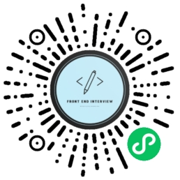
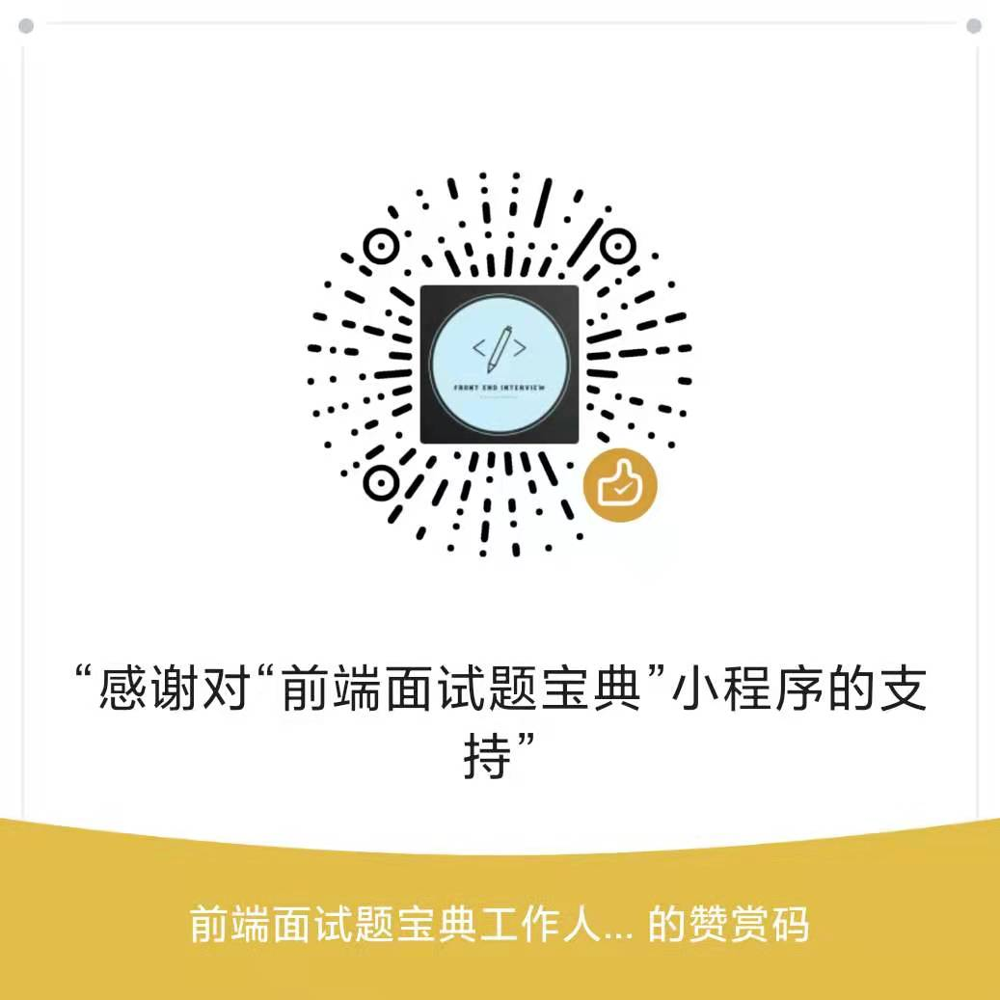

# 前端面试题宝典

前端是一个比较特殊的技术岗位，它的历史实际上并不长，但是前端领域的知识点之繁杂，技术迭代速度之快，却是其他技术不能比拟的。

这几年，前端行业的面试，也开始内卷，越来越多的人开始吐槽”面试造火箭，工作拧螺丝“。

其实无论是哪家的面试，问的东西都是比较相似的，基本都可以在网上搜到答案。

因为技术就是那个技术，就算是问出花来，本质或原理还是一样的。

同时，虽然网上的面试题一搜一大堆，但却鱼龙混杂，对面试者的帮助不是太大。

我们针对前端岗位面试者的一些痛点，联合一些前端领域的伙伴，推出了”**前端面试题宝典** “小程序，旨在为初、中级前端工程师，提供面试题的刷题及面试技巧指导服务，希望能够帮助您早日拿到心仪的offer。

**免责声明：本站的部分面试题来自网络，如有侵权，请联系删除。**

## 最近更新

<!-- recentUpdateIssueTable -->

<!-- recentUpdateIssueTable -->

## 完整题目列表

### 1-100题

<!-- top100IssueList -->

<!-- top100IssueList -->

### 101-200题

<!-- top200IssueList -->

<!-- top200IssueList -->

### 201-300题

<!-- top300IssueList -->

<!-- top300IssueList -->

### 301-400题

<!-- top400IssueList -->

<!-- top400IssueList -->
### 401-500题

<!-- top500IssueList -->

<!-- top500IssueList -->
### 500题+

<!-- top600IssueList -->
<!-- top600IssueList -->
## 官方订阅号

## 小程序码

## 赞赏码

面试题收集不易，如果觉得上面的题目对自己的面试有所帮助，可以进行打赏